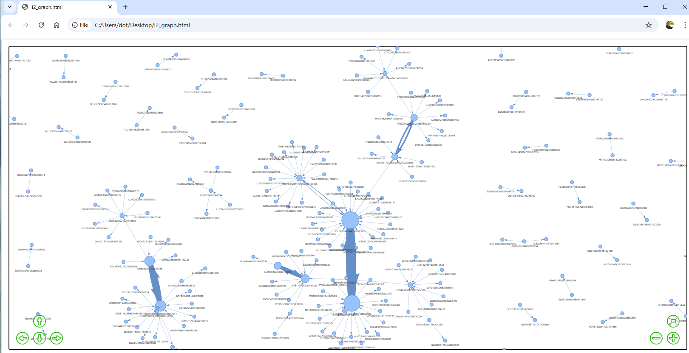

# NetViz

Network visualization tool for financial transfer data. Drag and drop spreadsheet files to create interactive network graphs showing money flows between accounts.

## Screenshots

### Application Interface

### Interactive Network Graph

### Detailed View with Transfer Information

## What it does
- Reads CSV/Excel/ODS files with "From" and "To" columns (plus optional "Amount")
- Automatically detects column names (handles variations like "from", "From", "FROM")
- Creates directed network graph with nodes as accounts and edges as transfers
- Shows transfer counts and amounts on hover
- Node size reflects transaction volume
- Generates interactive HTML file that opens in your browser

## Supported file formats
- CSV (with various separators: comma, semicolon, pipe, space)
- Excel (.xlsx, .xls)
- LibreOffice Calc (.ods)

## Data format
Your spreadsheet needs at least two columns:
- **From**: Source account/entity (required)
- **To**: Destination account/entity (required) 
- **Amount**: Transaction amount (optional)

Multiple transfers between same accounts are aggregated and counted.

## Features
- Drag-and-drop interface
- Automatic column detection
- Interactive visualization with zoom/pan
- Hover tooltips showing transfer details
- Physics-based graph layout
- Scales to handle large datasets

## Setup
1. Create virtual environment:
   python -m venv .venv
   . .\.venv\Scripts\Activate.ps1

2. Install dependencies:
   pip install pandas odfpy openpyxl networkx pyvis tkinterdnd2 pyinstaller

3. Run the app:
   python app.py

## Build executable
pyinstaller NetViz.spec

The exe will be created in dist/ folder.
